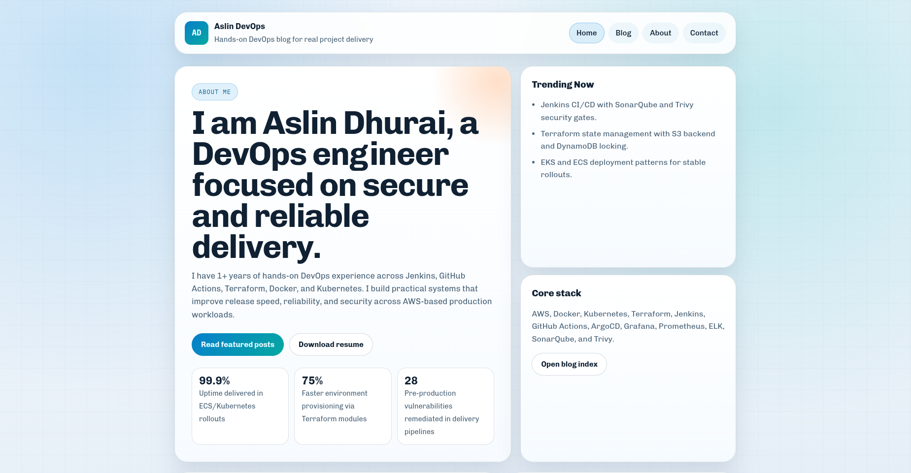

# Aslin DevOps Website

A lightweight Go portfolio and DevOps blog website for Aslin Dhurai. The app uses Go's standard `net/http` package to serve static HTML/CSS pages, resume download assets, and simple route redirects.

## Features

- Personal DevOps introduction on the Home page
- About page with experience highlights, skills, certifications, and achievements
- Blog page with DevOps article topics and project-based writing tracks
- Contact page with email, LinkedIn, GitHub, and resume download links
- Static resume PDF served from `/static/Aslin_DevOps.pdf`
- Legacy redirects from `/courses` and `/experiences` to `/blog`

## Tech Stack

- Go
- HTML
- CSS
- Docker

## Project Structure

```text
.
├── Dockerfile
├── go.mod
├── main.go
├── main_test.go
├── README.md
└── static/
    ├── Aslin_DevOps.pdf
    ├── about.html
    ├── contact.html
    ├── courses.html
    ├── home.html
    ├── styles.css
    └── images/
```

## Run Locally

```bash
go run .
```

Open the site at:

```text
http://localhost:8080/home
```

## Routes

| Route | Description |
| --- | --- |
| `/` | Redirects to `/home` |
| `/home` | Home page |
| `/blog` | Blog index |
| `/about` | About page |
| `/contact` | Contact page |
| `/static/Aslin_DevOps.pdf` | Resume PDF |
| `/courses` | Redirects to `/blog` |
| `/experiences` | Redirects to `/blog` |

## Run Tests

```bash
go test ./...
```

If your environment has a read-only Go build cache, use a local cache:

```bash
mkdir -p .cache/go-build
GOCACHE="$(pwd)/.cache/go-build" go test ./...
```

## Build Binary

```bash
go build -o main .
./main
```

## Run With Docker

Build the image:

```bash
docker build -t aslin-devops-website .
```

Run the container:

```bash
docker run --rm -p 8080:8080 aslin-devops-website
```

Then open:

```text
http://localhost:8080/home
```

## Repository Notes

The `.gitignore` is configured to keep local tooling and generated files out of the repository, including:

- `.codex/`
- `.agents/`
- `.cache/`
- compiled `main` binary

To push this project to a new repository:

```bash
git init
git add .
git commit -m "Initial commit"
git branch -M main
git remote add origin <new-repository-url>
git push -u origin main
```

## Screenshot


